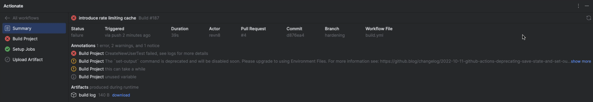
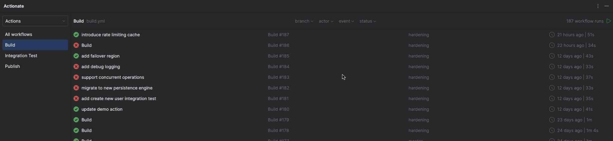
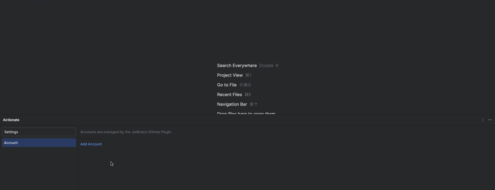

[![Get from Marketplace](https://img.shields.io/badge/Get%20from%20Marketplace-6600CC?style=flat&logo=data:image/svg+xml;base64,PHN2ZyB4bWxucz0iaHR0cDovL3d3dy53My5vcmcvMjAwMC9zdmciIHdpZHRoPSI2NCIgaGVpZ2h0PSI2NCIgZmlsbD0ibm9uZSI%2BCiAgICA8cGF0aCBmaWxsPSJ1cmwoI2EpIiBkPSJNMjIuMTQgMEg1OWMyLjc2IDAgNSAyLjI0IDUgNXYzNi44NmMwIDIuNjUtMS4wNTUgNS4xOTUtMi45MyA3LjA3TDQ4LjkzIDYxLjA3Yy0xLjg3NTEgMS44NzUyLTQuNDE4MSAyLjkyOTEtNy4wNyAyLjkzSDVjLTIuNzYgMC01LTIuMjQtNS01VjIyLjE0YzAtMi42NSAxLjA1NS01LjE5NSAyLjkzLTcuMDdMMTUuMDcgMi45M0MxNi45NDUxIDEuMDU0NzkgMTkuNDg4MS4wMDA4OTU3NiAyMi4xNCAwWiIvPgogICAgPHBhdGggZmlsbD0iIzAwMCIgZD0iTTUyIDEySDZ2NDZoNDZWMTJaIi8%2BCiAgICA8cGF0aCBmaWxsPSIjZmZmIiBkPSJNMTAgNTFoMTZ2M0gxMHoiLz4KICAgIDxkZWZzPgogICAgICAgIDxsaW5lYXJHcmFkaWVudCBpZD0iYSIgeDE9IjEiIHgyPSI2Mi43NSIgeTE9IjYzIiB5Mj0iMS4yNSIgZ3JhZGllbnRVbml0cz0idXNlclNwYWNlT25Vc2UiPgogICAgICAgICAgICA8c3RvcCBzdG9wLWNvbG9yPSIjRkY5NDE5Ii8%2BCiAgICAgICAgICAgIDxzdG9wIG9mZnNldD0iLjQzIiBzdG9wLWNvbG9yPSIjRkYwMjFEIi8%2BCiAgICAgICAgICAgIDxzdG9wIG9mZnNldD0iLjk5IiBzdG9wLWNvbG9yPSIjRTYwMEZGIi8%2BCiAgICAgICAgPC9saW5lYXJHcmFkaWVudD4KICAgIDwvZGVmcz4KPC9zdmc%2B)](https://plugins.jetbrains.com/plugin/26365)

__Actionate__ pulls GitHub Actions out of the browser and into your JetBrains IDE, eliminating costly browser context 
switching and supercharging your CI/CD workflow. Early beta testers report saving __5 to 10 minutes__ per Git push and
cutting troubleshooting time by __up to 25%__.

## Why Actionate?

Our mission is to create the best possible experience for you by harnessing the power of JetBrains IDEs to transform 
what's possible with GitHub Actions, unlocking advanced features and workflows that are not possible in the browser 
alone. We genuinely value your feedback, and invite you to help shape our roadmap by sharing your ideas and voting on 
new features.

## Features

### View Workflow Runs

Get a real-time view of both current and past workflow runs right inside your JetBrains IDE.

- __Current and Past Runs__\
  Monitor in-progress runs in real time and review completed ones at a glance.

- __Powerful Filtering__\
  Filter runs by branch, actor, event, or status, either individually or in combination, to quickly find exactly what you need.

- __Automatic Discovery__\
  New runs appear automatically, so you always have up-to-date information with zero extra clicks.

### View Comprehensive Workflow Run Details

View every detail of any workflow run including jobs, steps, logs, artifacts, annotations, and all run attempts directly 
inside your JetBrains IDE, so you can troubleshoot issues and manage everything in one place.

- __Run Metadata__\
  View details like overall status, triggering event, triggering actor, duration, associated pull request, commit, branch, 
  and the workflow file used.

- __Annotations__\
  Check run-level or job-level annotations directly in the IDE, and use automatically discovered links to open any 
  referenced URLs in your browser with a single click.

- __Artifacts__\
  View all artifacts produced by a run, with the option to download and open each one directly in your IDE.

- __Jobs__\
  View all jobs in a run and their corresponding status at a glance, so you can spot successes or failures instantly.

- __Steps__\
  See every step in a job along with its status, making it easy to track progress and identify issues.

- __Logs__\
  View all logs for a run, complete with collapsible log groups, color-coded notices, warnings, and errors, and 
  automatic link detection so you can open referenced URLs in your browser with a single click. Right-click any line to 
  copy its text, copy a direct link (perfect for sharing with teammates), or open it in the browser.

- __Run Attempts__\
  View all attempts for a run, making it simple to compare multiple executions and track changes over time.

### Rerun Workflow Runs

Rerun all jobs or just the failed ones, with optional debug logging for deeper insights, so you can fix issues without 
starting a new run from scratch.

- __Rerun All Jobs__\
  Restart the entire workflow.

- __Rerun Failed Jobs__\
  Focus only on jobs that encountered errors, saving time and resources.

- __Enable Debug Logging__\
  Turn on debug logs before re-triggering for deeper insights into your workflow runs.

### Manually Run Workflow

Trigger new runs for workflows that use the `workflow_dispatch` event trigger, complete with full support for all input 
parameter types, so you can customize and start jobs on-demand, right from your JetBrains IDE.

- __Trigger Any Dispatch-Ready Workflow__\
  Manually run any workflow that defines the `workflow_dispatch` event as a trigger.

- __Ref Picker__\
  Choose the branch or tag you want to run the workflow from.

- __Input Parameters__\
  Retrieve and populate all defined inputs for the selected ref, with full support for every parameter 
  type and respect for default values set in your workflow file.

- __Input Validation__\
  Required parameters must have a value before the workflow can be triggered, ensuring no critical inputs are overlooked.

> [!NOTE]
> Only workflows that use the `workflow_dispatch` event trigger are manually runnable.

### Multi-Account Support

Leveraging the [JetBrains GitHub plugin](https://www.jetbrains.com/help/idea/github.html) for account management, you 
can seamlessly work with multiple GitHub accounts. Set a global default or assign a unique account to each project for 
maximum flexibility.

- __JetBrains GitHub Plugin Integration__\
  Account management is powered by the [JetBrains GitHub plugin](https://www.jetbrains.com/help/idea/github.html) to 
  seamlessly handle multiple GitHub accounts.

- __Project-Specific Account Assignment__\
  Assign a dedicated GitHub account to each project. Once set, your configuration is saved, so you only need to assign 
  it once. You can update the assignment at any time by choosing a different active account in Actionate's settings.

## Getting Started

__Step 1: Install Actionate__

Start by installing Actionate and enjoy a 7-day free trial to explore its full range of features with no commitment.
After the trial, continue using the plugin for only \$1 per month or \$10 per year. For detailed installation instructions,
refer to the [JetBrains Plugin Documentation](https://www.jetbrains.com/help/idea/managing-plugins.html).

__Step 2: Add a GitHub Account__

Actionate leverages the [JetBrains GitHub plugin](https://www.jetbrains.com/help/idea/github.html) for account management.
If no GitHub account is found, you'll be prompted to add one on first launch. Click `add account` and follow the 
instructions to authenticate and add your account.

> [!NOTE]
> GitHub organizations can restrict the permissions of the JetBrains GitHub integration token, which can lead to issues.
> If you encounter problems, try logging in with a [classic Personal Access Token](https://docs.github.com/en/authentication/keeping-your-account-and-data-secure/managing-your-personal-access-tokens#creating-a-personal-access-token-classic)
> via the `Login with Token` option (ensure the token has repo scope). If your organization uses SSO, your PAT
> may need to be SSO authorized. We're working on automatically detecting this situation and notifying users when a PAT is needed.

__Step 3: Start Using Actionate__

Actionate automatically detects the GitHub repository for your open JetBrains project by reading its Git configuration.
If you see `no workflows`, it's likely because the project is not a GitHub repository or has no workflows defined.

## Support

If you encounter any issues or have suggestions for improvements, please create an issue in this repository. Your 
feedback is invaluable!

We offer the following issue templates to help you get started:

- __Bug Report__\
  If something is not working as expected, please use this template to provide details about the issue.

- __Feature Request__\
  If you have a suggestion for a new feature or enhancement, we'd love to hear it! Use this template to describe your idea.

- __Support Request__\ 
  If you need troubleshooting help or additional information, please use this template to outline your request.

## What's Next?

__Support Extremely Long Logs__

Actionate currently handles 99% of logs seamlessly. However, extremely long logs trigger an 
`Oops, something unexpected happened` error. The Actions Web UI can't currently handle these extremely long logs either, 
you're prompted to download the raw logs instead. This upcoming enhancement will ensure that all logs, regardless of 
size, are fully supported.

__Log Search__

Quickly locate specific entries in your logs without manual scrolling, just enter a search term to instantly find what 
you need.

__Smart Log Navigation__

Easily jump to the beginning or end of your logs, or directly to notices, warnings, and errors, for a more streamlined experience.

__Enhanced Log Formatting__

Display logs with full support for ANSI color codes and other formatting improvements, ensuring a visually rich, 
easy-to-read output for efficient debugging and analysis.

- __Manage Environments, Variables, and Secrets__

Manage repository environments, Actions variables, and secrets directly from your IDE, with auto-complete support for 
those values when authoring workflow files.

### But Wait, There (Will) Be More

These are just the next immediate features we have planned. We have a huge list of exciting ideas for the future. And
honestly, we'd love your input! Drop us a feature request or just say hi, we'd be thrilled to build something that makes
your workflow smoother and your day a little easier.
