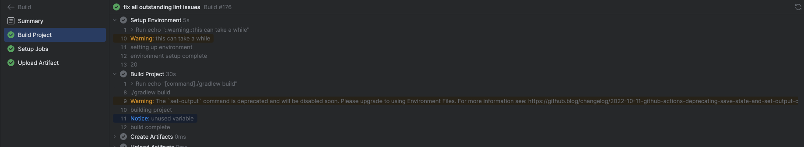

[![Get from Marketplace](https://img.shields.io/badge/Get%20from%20Marketplace-6600CC?style=flat&logo=data:image/svg+xml;base64,PHN2ZyB4bWxucz0iaHR0cDovL3d3dy53My5vcmcvMjAwMC9zdmciIHdpZHRoPSI2NCIgaGVpZ2h0PSI2NCIgZmlsbD0ibm9uZSI%2BCiAgICA8cGF0aCBmaWxsPSJ1cmwoI2EpIiBkPSJNMjIuMTQgMEg1OWMyLjc2IDAgNSAyLjI0IDUgNXYzNi44NmMwIDIuNjUtMS4wNTUgNS4xOTUtMi45MyA3LjA3TDQ4LjkzIDYxLjA3Yy0xLjg3NTEgMS44NzUyLTQuNDE4MSAyLjkyOTEtNy4wNyAyLjkzSDVjLTIuNzYgMC01LTIuMjQtNS01VjIyLjE0YzAtMi42NSAxLjA1NS01LjE5NSAyLjkzLTcuMDdMMTUuMDcgMi45M0MxNi45NDUxIDEuMDU0NzkgMTkuNDg4MS4wMDA4OTU3NiAyMi4xNCAwWiIvPgogICAgPHBhdGggZmlsbD0iIzAwMCIgZD0iTTUyIDEySDZ2NDZoNDZWMTJaIi8%2BCiAgICA8cGF0aCBmaWxsPSIjZmZmIiBkPSJNMTAgNTFoMTZ2M0gxMHoiLz4KICAgIDxkZWZzPgogICAgICAgIDxsaW5lYXJHcmFkaWVudCBpZD0iYSIgeDE9IjEiIHgyPSI2Mi43NSIgeTE9IjYzIiB5Mj0iMS4yNSIgZ3JhZGllbnRVbml0cz0idXNlclNwYWNlT25Vc2UiPgogICAgICAgICAgICA8c3RvcCBzdG9wLWNvbG9yPSIjRkY5NDE5Ii8%2BCiAgICAgICAgICAgIDxzdG9wIG9mZnNldD0iLjQzIiBzdG9wLWNvbG9yPSIjRkYwMjFEIi8%2BCiAgICAgICAgICAgIDxzdG9wIG9mZnNldD0iLjk5IiBzdG9wLWNvbG9yPSIjRTYwMEZGIi8%2BCiAgICAgICAgPC9saW5lYXJHcmFkaWVudD4KICAgIDwvZGVmcz4KPC9zdmc%2B)](https://plugins.jetbrains.com/plugin/26365)

__Actionate__ pulls GitHub Actions out of the browser and into your JetBrains IDE, eliminating costly browser context 
switching and supercharging your CI/CD workflow. Early beta testers report saving __5 to 10 minutes__ per Git push and
cutting troubleshooting time by __up to 25%__.

## Why Actionate?

Our mission is to create the best possible experience for you by harnessing the power of JetBrains IDEs to transform 
what's possible with GitHub Actions, unlocking advanced features and workflows that are not possible in the browser 
alone. We genuinely value your feedback, and invite you to help shape our roadmap by sharing your ideas and voting on 
new features.

## Features

### Works with multiple GitHub Accounts

Actionate makes it easy to use multiple GitHub accounts. You can set a default account that will be used across all 
your projects, or configure a specific account for each project.

- __Default Account:__ Choose one account that Actionate will automatically use for all projects. This account will be 
  used unless explicitly overridden by a project-specific setting.

- __Project-Specific Accounts:__ For added flexibility, you can set a unique GitHub account for each project. 
  This allows you to seamlessly switch between different accounts without the need for manual reconfiguration.

If you have only one GitHub account added, that account will automatically be used.

If multiple accounts are added and no default or project-specific account is set, you will be prompted to choose which 
account to use on first use.

Actionate leverages the JetBrains GitHub plugin for GitHub account management. For more details on managing your
accounts, check out the [JetBrains GitHub plugin documentation](https://www.jetbrains.com/help/idea/github.html).

To set the GitHub account for Actionate to use, go to `Actionate` -> `Settings` -> `Account` and select from the
available accounts sourced from the JetBrains GitHub plugin.

__Note:__ Some organizations restrict the permissions of the JetBrains GitHub integration token, which may cause 
unexpected issues. If you encounter problems, try logging in with a [classic Personal Access Token (PAT)](https://docs.github.com/en/authentication/keeping-your-account-and-data-secure/managing-your-personal-access-tokens#creating-a-personal-access-token-classic) via the 
`Login in with Token` option. The token requires repo scope. We are working on a way to automatically detect this 
situation and inform users when a PAT is required.

### View Workflow Runs

With Actionate, you can easily view both current and past workflow runs, directly within your JetBrains IDE. Whether 
you’re monitoring the progress of a new run or reviewing historical executions, Actionate provides a streamlined way to 
access all relevant information.

- __Current and Past Workflow Runs:__ View the status, jobs, steps, logs, annotations, and artifacts of both ongoing and completed workflows.

- __Automatic Discovery:__ New workflow runs are automatically discovered and shown in the IDE without requiring you to 
  manually refresh. This ensures you always have up-to-date information about your workflows.

- __Comprehensive Details:__ Dive deep into each workflow run to examine job statuses, view individual step outputs, and 
  inspect logs to troubleshoot or analyze build performance.

- __Powerful Filtering:__ Easily filter workflow runs by branch, actor, event, and status, allowing you to quickly find 
  the specific runs you need. Whether you’re looking for a run triggered by a specific person, on a particular branch, 
  or based on a certain event type, Actionate makes it simple to narrow down your results.

### View Comprehensive Workflow Run Details

Actionate makes it easy to dive deep into the specifics of any workflow run. With detailed insights into each run, you 
can analyze performance, troubleshoot issues, or simply monitor the execution of your workflows—all directly from your 
JetBrains IDE.

- __Job and Step Breakdown:__ See each job and its corresponding steps within a workflow run, with detailed information 
  on each step’s status, logs, and execution time.

- __Logs and Annotations:__ View logs for individual jobs and steps, along with any annotations that provide additional 
  context, such as warnings, errors, or notices, making it easier to identify and address issues.

- __Artifacts and Build Reports:__ Access and download artifacts generated during the workflow run, such as build 
  outputs, test results, or reports. This allows you to examine the results in detail without leaving the IDE.

- __Run Metadata:__ View and open key details such as commit, branch, pull request, and workflow file associated with a run.

- __Interactive Log Navigation:__ Navigate logs easily with expandable log groups, log message color formatting (notice, warning, error), 
  and the ability to open specific log lines directly in GitHub for further investigation.
    - __Copy Link to Log Line:__ Copy the link to any specific log line in GitHub to easily share it with colleagues. 
      This ensures that everyone is looking at the same information, making collaboration and troubleshooting more efficient.

- __View All Run Attempts:__ View comprehensive details for __all__ run attempts.

### Rerun Workflow Runs

Actionate provides you with the ability to rerun a workflow run, allowing you to quickly re-trigger jobs to resolve 
issues or retry builds without needing to manually start a new workflow. Whether you’re dealing with a failed job or 
want to rerun the entire workflow, Actionate makes it seamless to get things running again.

- __Rerun All Jobs:__ You can easily rerun all the jobs within a workflow run.

- __Rerun Failed Jobs:__ If only certain jobs failed, you can opt to rerun just the failed jobs. This saves you time 
  and resources by skipping the jobs that were successful, allowing you to focus on the issues at hand.

Each rerun is treated as a new run attempt, allowing you to view fresh logs, step statuses, and artifacts. Actionate’s 
rerun feature allows you to quickly iterate and address issues in your workflows, making it easier to keep your build 
process smooth and efficient.

### Manually Trigger Workflow Runs

With Actionate, you can manually trigger a new workflow run for workflows that include the workflow_dispatch trigger. 
This feature provides full support for all input parameters defined in the workflow, allowing you to customize and 
initiate new runs whenever you need.

- __Trigger Workflows with Workflow Dispatch:__ Easily manually trigger workflows that have the workflow_dispatch trigger 
  enabled, providing full flexibility to initiate builds or processes on-demand.

- __Support for Input Parameters:__ Actionate fully supports all input parameter types defined in your workflow’s 
  workflow_dispatch trigger. Whether it’s a simple text field, a choice, or a boolean, you can provide the necessary 
  inputs when triggering a run.

- __Ref Picker:__ Select which Git reference (branch or tag) to trigger the workflow from. Actionate automatically 
  retrieves the available input parameters for each reference, ensuring that you’re using the correct parameters for 
  your selected ref.

- __Customizable and On-Demand:__ With manual triggers, you can start workflows as needed, giving you more control over 
  your CI/CD process. Whether for testing, re-deployments, or special cases, you have the flexibility to trigger 
  workflows on your terms.

Actionate’s support for workflow_dispatch gives you greater control over your workflows, allowing you to initiate runs 
with custom inputs and tailored configurations right from your JetBrains IDE.

## 🚀 Coming Soon

We’re always looking for ways to improve Actionate, and we're thrilled to share what's coming in the next few immediate
releases. These features are designed to make your GitHub Actions experience inside JetBrains IDEs even smoother and
more powerful. And this is just the beginning. We've got tons more in the pipeline, and we'd love to hear your ideas too!

### What's Next?

Here's what you can expect very soon:

- __Graceful Handling of Extremely Long Logs__

  Say goodbye to sluggish scrolling, freezing, and those "Oops, something unexpected happened" errors—yeah, we probably
  should have paginated large logs from the start... our bad.

- __Log Search__

  Ever tried finding that one failing test buried in 70,000 lines of logs? We've got you covered. A powerful search
  feature is on the way to help you locate exactly what you need—no more manual scrolling marathons.

- __Richer Log Formatting__

  We're adding support for ANSI color codes and other enhancements to bring your logs to life.

- __Managing Actions Environments, Variables, and Secrets__

  You'll soon be able to handle all your environment variables and secrets directly from the IDE. Even better,
  Actionate will auto-complete those values when you're authoring workflow files—so no more worrying about
  fat-fingering a hardcoded string again.

### But Wait, There (Will) Be More...

These are just the next features we're rolling out. We have a huge list of exciting ideas for the future. And honestly?
We'd love your input. We want to hear from you! What would make the perfect GitHub Actions workflow inside your
JetBrains IDE? No idea is too big, too small, or too weird.

Drop us a feature request or just say hi—we'd be thrilled to build something that makes your workflow smoother and
your day a little easier.

## Getting Started

Getting started with Actionate is easy and only requires a few simple steps:

1. __Install the Actionate plugin__

   Install Actionate in your preferred JetBrains IDE. For detailed plugin installation instruction, refer to 
   the [JetBrains Plugin Documentation](https://www.jetbrains.com/help/idea/managing-plugins.html)

2. __Add a GitHub Account__
   
   Actionate integrates with the [JetBrains GitHub plugin](https://www.jetbrains.com/help/idea/github.html). To use it, add your GitHub account by navigating to 
   `Settings -> GitHub` and follow the instructions to authenticate with your GitHub account.

   __Note:__ Some organizations restrict permissions for the JetBrains GitHub integration token, which may cause
   unexpected issues. If you encounter problems, try logging in with a [classic Personal Access Token (PAT)](https://docs.github.com/en/authentication/keeping-your-account-and-data-secure/managing-your-personal-access-tokens#creating-a-personal-access-token-classic) via the
   `Login in with Token` option. The token requires the `repo` scope. If your organization uses Single Sign-On (SSO), 
   ensure that you authorize SSO access for your PAT to avoid authentication issues. We're working on an automatic 
   detection feature to notify users when a PAT is required.

3. __Workflow Detection__

   Actionate automatically detects the GitHub repository associated with your open JetBrains project by examining the 
   project's Git configuration.
   - If you don't see any workflows listed, it's likely because the open project is either not a GitHub repository or no workflows are currently associated with it.
   - If you'd prefer to manually set the repository instead of relying on automatic detection, please let us know by opening a `Feature Request` issue.

## Support

If you’re experiencing unexpected behavior or have an idea for a new feature or enhancement, please don’t hesitate to 
create an issue in this repository. Your feedback is important to us!

We offer the following issue templates to help you get started:

- __Bug Report:__ If something is not working as expected, please use this template to provide details about the issue.

- __Feature Request:__ If you have a suggestion for a new feature or enhancement, we’d love to hear it! Use this 
  template to describe your idea.

- __Support Request:__ If you need troubleshooting help or additional information, please use this template to outline your request.

We’re committed to improving Actionate and appreciate your contributions!

## Screenshots

